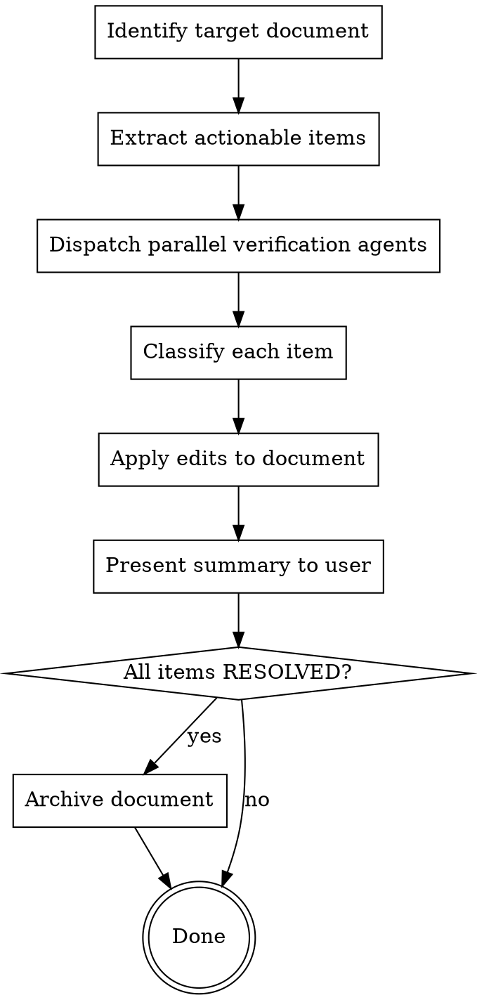

# Sync Document Status Against Codebase

Analyze review/plan/TODO documents and update each item's status based on the current state of the code, git history, and file system.

## Process



### Step 1: Extract actionable items

Read the target document. Identify every item that describes a problem, recommendation, task, or TODO. For each item, extract:

- **ID**: section number or task label (e.g., "1.3.3", "Task 5", "D.2")
- **Claim**: what the document says the code looks like (e.g., "VAO class exists", "update() scans all materials")
- **Verification strategy**: what to check — file existence, class/function grep, git log keyword, line count, API signature

### Step 2: Verify against codebase

Dispatch Explore agents in parallel to verify items. Group related items to reduce agent count (e.g., all RHI items in one agent, all material items in another).

**Verification has two layers — both are required:**

#### Layer 1: Surface checks (existence / absence)

Quick structural checks to narrow the status:

- **Grep** for class names, function names, patterns mentioned in the document
- **Git log** for relevant keywords (`git log --oneline -20 --all --grep="keyword"`)
- **File existence** / line count / include structure
- **Return evidence**: exact file paths, line numbers, commit hashes, or "not found"

#### Layer 2: Architectural analysis (behavior / design)

**Read the actual implementation** to verify the claim is truly resolved, not just superficially addressed. This is the critical step that prevents false positives.

| Claim type | Surface check (not enough) | Architectural analysis (required) |
|---|---|---|
| "X does full scan" | grep for `dirty` keyword | **Read the function's control flow** — does it iterate all items or only dirty ones? Trace the loop, check conditionals |
| "No async execution" | grep for `QueueType` enum | **Read execute() dispatch logic** — does it actually submit to different queues with fence sync? |
| "5 subclasses of X" | grep for class names | **Read the class hierarchy** — are they truly separate classes or aliases/typedefs to a unified type? |
| "Returns ref<T> (overhead)" | grep for return type | **Read callers** — do they still pay the refcount cost, or has the call pattern changed? |
| "No dirty list" | grep for `dirty` | **Read the update loop** — trace data flow from mark-dirty to per-frame processing to upload |
| "Single-threaded recording" | grep for `thread`/`parallel` | **Read the frame loop** — is execute() sequential? Are CommandContexts shared or per-pass? |
| "Class is too large (N lines)" | `wc -l` on the file | **Scan the class** — is it still monolithic, or have responsibilities been extracted to sub-objects? |

**The agent prompt must explicitly instruct:** "Do not just grep for keywords. Read the relevant functions and trace the logic to confirm the behavioral claim."

**Key principle:** verify the claim in the document, not just whether a fix exists. A grep hit for `dirty` does not mean a dirty list is implemented — you must read the code path to confirm.

### Step 3: Classify each item

Based on verification evidence, classify into exactly one category:

| Status | Criteria | Marker format |
|--------|----------|---------------|
| **RESOLVED** | The described problem no longer exists in the code | `— RESOLVED (YYYY-MM)` + italicized summary of what was done |
| **Partially resolved** | Core issue addressed but notable work remains | `— *partially resolved: [what's done] ; [what remains]*` |
| **Unchanged** | Problem still exists exactly as described | No marker needed (document is already accurate) |
| **Outdated** | The description is factually wrong about current state but item is NOT resolved | `— *outdated: [correction]*` |

### Step 4: Apply edits

For each non-unchanged item, edit the document:

1. **Add status marker** to the item heading (inline, after the bold title)
2. **Add italicized evidence line** immediately below the heading, before the original text
3. **Strikethrough** original description text for RESOLVED items (use `~~text~~`)
4. **Do NOT delete** any original text — strikethrough preserves history
5. **Update summary tables** if the document has them — add a "Resolved Since Review" or "Status" column

### Step 5: Present summary

After editing, output a concise table:

```
| Item | Status | Evidence |
|------|--------|----------|
```

## Common false-positive traps

These are situations where surface checks say "resolved" but architectural analysis reveals otherwise:

| Trap | Surface looks like | Reality check |
|---|---|---|
| **Keyword exists but unused** | grep finds `dirty` in code | The dirty flag is set but the update loop ignores it |
| **Enum exists but not wired** | `QueueType::Compute` defined | `execute()` never actually dispatches to a compute queue |
| **Class renamed but not refactored** | Old class gone | New class has same problems (e.g., still monolithic) |
| **Feature behind dead code** | Implementation exists | No caller ever invokes it, or it's `#if 0`'d out |
| **Partial migration** | New API exists | 80% of call sites still use the old API |
| **Type alias illusion** | `using OldName = NewType` | Consumers still use OldName patterns, no behavioral change |

## Step 6: Archive completed documents

After updating and presenting the summary, check if **every** actionable item in the document is RESOLVED. If so:

1. **Move the file** to the archive directory:
   - `docs/plans/foo.md` → `docs/archive/foo.md`
   - `docs/research/foo.md` → `docs/archive/foo.md`
2. **Announce** to the user: "Archived `<filename>` — all items resolved."

**Do NOT archive if:**
- Any item is unchanged, partially resolved, or outdated
- The document is a living reference (e.g., discussion points doc with mixed status)
- The document was just created in the current session

## Rules

- **Never guess** — every status change must have grep/read/git evidence
- **Conservative classification** — if uncertain, classify as "unchanged" rather than "resolved"
- **Preserve original text** — use strikethrough, never delete
- **Batch verification** — use parallel Explore agents grouped by subsystem, not one agent per item
- **Date stamps** — RESOLVED markers include year-month (e.g., `2026-03`) not exact dates
- **Skip strengths** — only verify items in "Issues", "Gaps", "Recommendations", "TODOs" sections. Strengths sections are informational and don't need status updates.
