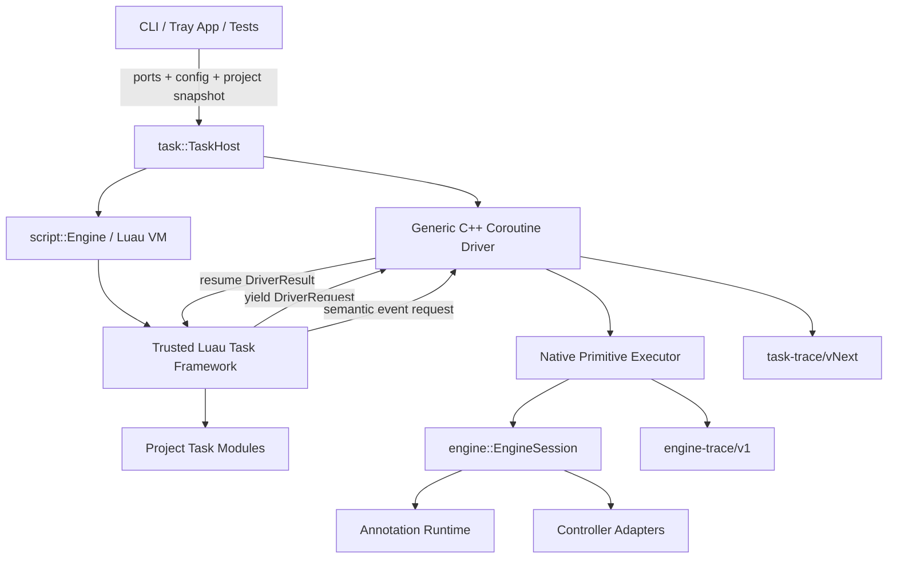
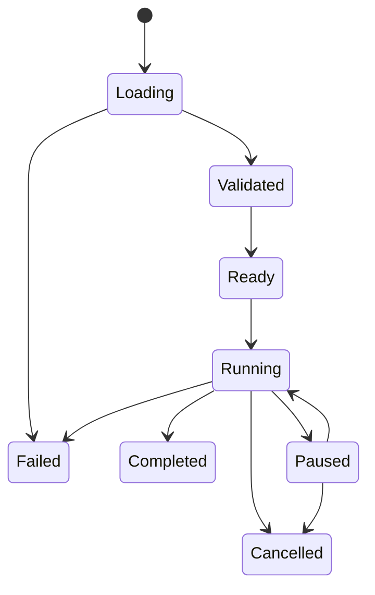

# Luau-First Task System 详细设计草案

> **词汇重定向(2026-07-31)。** 本文是有日期的记录,不改写。下文的
> `recognizer` / `RecognizerId` / `uf.recognizers` / `recognizerId` 一律读作
> **element** / `ElementId` / `uf.elements` / `elementId`;`RecognizerDefinition`
> 与 `RecognizerVariant` 读作 `CompiledElement` 与 `CompiledAppearance`;
> `Variant` / `variant` 读作 `Appearance` / `appearance`。`RecognitionCatalog` 与
> `RecognitionRuntime` 名字不变——它们指的是「识别」这个动作。schema id 随改名一起动了:
> `umbraflow-authoring/v4`、`umbraflow-annotations/v3`、`umbraflow-trace/v2`。
> 权威词汇见 `CONTEXT.md` 的「Annotation model」一节。

> **已被取代(2026-07-29)。** 本文**全文**由
> [`2026-07-29-three-layer-task-system.md`](../../plans/2026-07-29-three-layer-task-system.md)
> 取代,不再是任何实现的依据。促成该决定的评审是
> [`docs/reviews/2026-07-28-luau-first-draft-review.md`](../reviews/2026-07-28-luau-first-draft-review.md):
> 分层判断被采纳,阶段排序与 yield/request driver 论证被落地代码证伪(见新文 §11)。
> 本文正文原样保留为历史,请勿据此实现;其中的 `umbra` 根、`resources` 根、
> driver/yield 方案与阶段 A–F 排序均已作废。
>
> 状态:草案,等待开发者评审。
>
> 日期:2026-07-28。
>
> 权威性:本文是待评审 proposal,尚未取代现有 roadmap、ADR、P0-B 脚本层裁决或
> 当前实现。只有开发者确认并完成相关文档漂移修正后,目标架构才成为新的实现依据。
>
> 目标:把 UmbraFlow 的 task system 定义为一套随产品发布、版本固定、可信的
> Luau framework。C++ 只负责创建和驱动运行环境、执行原子能力并强制安全约束;
> 每个 project 只提供该游戏的 task 与游戏相关逻辑。
>
> 本文描述目标架构和迁移边界,不是实现计划。评审通过后再移除 draft 状态、
> 修正受影响的现行文档,并另写分阶段 implementation plan。

## 1. 核心结论

目标系统分为三层:

```text
C++ Driver Kernel
    创建 VM,驱动 coroutine,执行原子请求,强制安全和资源约束

Trusted Luau Task Framework
    定义 task 生命周期、step、等待、重试、interrupt、subtask、热加载安全点

Project Tasks
    定义一个游戏的页面流程、业务条件、操作顺序和恢复策略
```

最重要的所有权原则是:

> C++ 决定一个请求是否安全且可执行;Luau framework 决定一个 task 如何运行;
> project task 决定这个游戏要做什么。

“C++ 只负责驱动”不等于 C++ 是一个无条件执行 Lua 命令的薄壳。以下约束必须由
C++ 最终裁决,不能依赖 framework 或 project task 自觉:

- VM sandbox、内存配额、指令预算和 wall-clock 运行上限。
- cancellation 的最终停止和 cancelled generation 的永久作废。
- frame、observation、recognition evidence 和 native resource 的所有权。
- CaptureSessionId、TargetGeneration、FrameId 和 observation lease 校验。
- 页面证据、action detection、目标兼容性和动作授权。
- 严格后台输入及投递前 target revalidation。
- trace 文件写入、run identity、源码 hash、framework version 和 seed stamping。

除此之外,凡是回答“task 接下来做什么、何时重试、何时等待、如何组合步骤”的
逻辑,原则上都属于可信 Luau framework 或 project task。

## 2. 设计目标

### 2.1 产品目标

1. project 作者只编写游戏逻辑,不复制 task runtime、取消、trace 或调度代码。
2. 新增或调整一个游戏流程不需要重新编译 C++。
3. framework 可以独立演进 task 模型,但升级是显式、版本化、可回归的。
4. P0 的一次一 run 可以自然升级到 P2 常驻 App,不更换 project task API。
5. task 的控制流能被 trace、测试、UI 和未来调度器稳定观察。

### 2.2 工程目标

1. `modules/script` 继续只拥有 Luau VM substrate,不认识 task、engine 或游戏。
2. `modules/engine` 继续只拥有观察、识别、授权和动作执行,不依赖 Luau。
3. `modules/task` 成为 C++ driver kernel 和 bundled Luau framework 的共同归属。
4. `entry/cli`、未来 tray app 和测试只提供 ports/configuration,不重写 task 生命周期。
5. effectful host operation 使用统一的 yield/request/result 协议,避免长期等待循环
   重新长回 C++ binding。
6. project task 不直接获得 raw native driver,只能使用 frozen framework API。

### 2.3 非目标

- 不把识别算法、坐标变换、action authorization 或 controller 投递改写成 Luau。
- 不允许 project task 读取任意文件、网络、环境变量或用户 bytecode。
- 不追求抵御恶意第三方脚本的 OS 级隔离;当前仍是可信作者模型。
- 不在第一阶段实现多 task 并发、运行中状态迁移或分布式 worker。
- 不设计一套纯声明式 workflow language 取代 Luau 本身。
- 不保证 hard cancellation 时 Luau `finally` 风格清理一定运行;资源清理由 C++ RAII
  保证。

## 3. 术语

### C++ Driver Kernel

产品无关的 native runtime。它创建 VM、加载 framework 和 project source snapshot,
恢复 task coroutine,执行 `DriverRequest`,并把 `DriverResult` 送回 framework。

### Trusted Luau Task Framework

随 UmbraFlow 二进制一起发布的 Luau framework。它不是 project 内容,project
不能替换或修改。它持有 private native capability,向 project 暴露 frozen high-level
API。

### Project Task

位于一个 project 的 `tasks/` 下、按 project 内名称寻址的游戏流程。它只依赖
framework 和该 project 发布的 page/action/resource handles。

### Driver Request

framework 在 effect boundary yield 给 C++ 的不可伪造 opaque request。它只表达
一个原子请求,不表达 task policy。

### Observation Cycle

framework 的一个观察周期:取得一个 fresh frame,对同一 frame 做页面解析和若干
识别,在必要时消费该 observation 执行至多一个坐标动作。动作后进入下一周期。

### VM Generation

framework version、project source snapshot、resource snapshot、seed 和配置共同定义的
一次隔离 VM generation。generation 一旦 hard-cancelled 就永不恢复。

## 4. 总体架构



依赖方向保持:

```text
entry -> task -> script
              -> engine -> annotation
                        -> controller ports at composition

engine -X-> task
engine -X-> script
script -X-> task
```

controller 具体 adapters 仍在 composition root 构造,以 `IFrameSource` 和
`IActionSink` 形式交给 engine。`task::TaskHost` 只看到已构造的 `EngineSession`
或等价 owning capability。

## 5. 信任与环境分层

### 5.1 两个 Luau 权限层

同一个 VM generation 内有两个逻辑权限层:

1. framework environment:
   - 能访问 private native capability。
   - 能持有 framework 私有的 coroutine/yield、deadline 和 event helpers。
   - 在 project source 执行前完成初始化并冻结 exports。
2. project environment:
   - 只能访问安全标准库、frozen framework API 和 frozen resource tables。
   - 没有 `_G`、debug、coroutine、filesystem、network 或 raw native capability。
   - 不能读取 framework closure 的 upvalues。

建议 boot 顺序:

```text
create quota-backed VM
-> open approved base libraries
-> install private native capability into framework-only environment
-> compile/load trusted framework bundle
-> obtain and freeze FrameworkExports + FrameworkRunner
-> remove dangerous globals and apply Luau sandbox
-> create isolated project environment
-> expose frozen task/resources API
-> compile/load validated project source snapshot
-> hand task descriptor to FrameworkRunner
```

private native capability 不作为 project global 出现。framework 通过闭包 upvalue 持有
它;project 只能拿到 `Context` 和只读 handles。debug 库必须在 project 代码执行前
移除,防止读取 framework upvalues。

### 5.2 Defense in depth

framework 是产品自带可信代码,但 C++ 仍验证它发出的每个 request:

- request kind 必须已知。
- userdata 必须属于当前 VM generation 和当前 EngineSession。
- 参数范围、duration、resource identity 和 handle kind 必须有效。
- page/hit/frame 必须来自同一个 observation cycle。
- action authorization 必须重新经过 engine。
- semantic trace event 的 kind、字段长度和状态转换必须合法。

即使 framework bug 或 project 设法绕过 high-level API,也不能突破 C++ 安全约束。

## 6. 各层职责

### 6.1 `modules/script`

保留:

- quota-backed `lua_State` ownership。
- compiler/load/resume substrate。
- sandbox primitives。
- instruction interrupt、max runtime 和 cancellation。
- Luau ABI/FFI boundary。

移出或不新增:

- task lifecycle。
- host capability 的产品语义。
- task trace schema。
- page/action/wait/retry/interrupt 概念。

`script::Engine::runNumber()` 最终不再是产品 task runner。`modules/task` 使用更低层的
“load thread / resume / inspect yield”接口,而 substrate 测试可以继续保留
`runNumber()`。

### 6.2 C++ side of `modules/task`

目标职责:

- `TaskHost`:一次 run 的 composition-neutral owning facade。
- framework bundle 的加载、版本/hash 校验和 boot。
- project source snapshot 的受控加载、hash 和 AST/resource validation。
- VM generation ownership。
- generic coroutine driver。
- `DriverRequest` validation/execution。
- native handles 和 observation retention。
- task trace sink 和 authoritative lifecycle events。
- generation build/install/swap mechanics。

不再拥有:

- `wait_for_page` 的循环策略。
- retry/backoff policy。
- popup interrupt registry 或 first-match policy 的实现。
- task step tree。
- subtask call semantics。
- project-specific completion conditions。

### 6.3 Trusted Luau framework

拥有:

- task descriptor 和 project module contract。
- task lifecycle 的语义状态。
- `Context` high-level API。
- step nesting、命名和 semantic trace。
- observation-cycle orchestration。
- wait/retry/backoff。
- interrupt registration、ordering、max hits 和 no-reentry。
- subtask/module composition。
- task-level error translation。
- task-safe-point definition。
- hot reload cooperative checkpoint semantics。

framework 不得:

- 构造或修改 native evidence。
- 直接读写 trace file。
- 自己实现 wall-clock watchdog。
- 自己决定 cancellation 是否可以忽略。
- 绕过 driver 执行输入。

### 6.4 Project tasks

拥有:

- 一个游戏的页面流转。
- 哪些 recognizer/page 代表业务状态。
- 操作顺序、条件分支和成功条件。
- 业务级 retry selection,但使用 framework 提供的 bounded policy。
- 游戏 popup 的注册和处理函数。
- 游戏内可复用 subtask,如 `return_home`、`claim_rewards`。

不得拥有:

- framework 的拷贝或 fork。
- native path、window handle、pixel buffer 或 controller object。
- 任意文件路径加载。
- 自定义未受约束的 scheduler/thread/coroutine。

## 7. C++ 驱动协议

### 7.1 为什么使用 yield/request

如果 project/framework 继续直接调用长时间运行的 C binding:

```lua
local page = native.wait_for_page(...)
```

那么等待、轮询、interrupt 和 retry 仍然实际属于 C++,Luau 只是在调用一个大黑盒。
这不符合 Luau-first task system 的目标,也使 C++ host call 成为取消和可观测性的
长临界区。

目标协议:

```text
framework produces DriverRequest
-> framework coroutine yields
-> C++ validates and executes one request
-> C++ produces DriverResult
-> C++ resumes the same coroutine
-> framework continues its state machine
```

C++ driver 只知道 request/response,不知道 task step、popup 或 retry 的业务含义。

### 7.2 Request representation

推荐使用 host-minted full userdata:

```text
DriverRequest
    generation identity
    request sequence
    request kind
    validated payload / native handles
```

framework 通过 private native helpers 创建 request。project 看不到这些 helpers,
也没有 coroutine library,因此不能正常制造或 yield 自定义 request。C++ 仍拒绝
任何不是当前 generation mint 出来的 request。

第一版 request kinds:

| Kind | 输入 | 输出 | 说明 |
|---|---|---|---|
| `Capture` | 无 | `FrameHandle` | fresh observation |
| `ResolvePage` | frame | `PageOutcomeHandle` | 同帧页面解析 |
| `FindAction` | frame, recognizer | `HitHandle or Empty` | 同帧 action 查找 |
| `Click` | resolved page, hit | `ActReceipt` | 消费 observation |
| `Poll` | opaque deadline, interval | `Ready or TimedOut` | cancellable host wait |
| `MakeDeadline` | bounded duration | `DeadlineHandle` | framework 不读取墙钟 |
| `EmitSemanticEvent` | validated event | ack | task/step/interrupt trace |
| `Checkpoint` | reason | control response | pause/reload/cancel safe point |

`ResolvePage` 和 `FindAction` 即使当前实现可以同步返回,仍建议纳入统一 effect
协议。这样每个可能昂贵或失败的 host operation 都经过同一 cancellation、trace
和 resume boundary。

### 7.3 Result representation

推荐 `DriverResult` 也是 opaque userdata,由 framework private helper 解包为:

```text
Succeeded(value)
Empty
Failed(AutomationError)
```

`Cancelled` 不作为普通 result 返回。C++ 一旦观察到 external stop、instruction
budget 或 runtime deadline:

1. 标记 generation terminal。
2. 不再 resume framework/project coroutine。
3. 由 C++ RAII 释放所有 native resources。
4. 写 authoritative `TaskFinished(Cancelled)`。

这样 cancellation 不可能被 project 的 `pcall`、framework bug 或 retry policy
降级成可恢复错误。

### 7.4 Request loop

概念伪代码:

```cpp
for (;;)
{
    auto outcome = vm.resume(input);

    if (outcome.completed())
    {
        return TaskExit::Completed;
    }
    if (outcome.failed())
    {
        return classifyScriptFailure(outcome);
    }

    auto request = validateYield(outcome.yieldedValue());
    auto result  = executeRequest(request, context);
    input        = result;
}
```

这段 loop 是 C++ driver,但没有 task policy。它与一个通用 async executor 类似:
Lua 定义状态机,C++ 只推进它并执行 effects。

## 8. Framework project API

### 8.1 Task descriptor

一个 task module 返回由 framework 构造的 descriptor:

```lua
return task.define {
    interrupts = {
        popups.network_error,
        popups.reward_notice,
    },

    run = function(ctx)
        -- game-specific flow
    end,
}
```

task 名来自 `(project, taskName)` 地址,不要求源码重复声明 `name`,避免文件名和
descriptor 漂移。descriptor frozen,只能由 `task.define` 创建。

第一版 completion contract:

- `run(ctx)` 正常返回:Completed。
- 未捕获的 structured automation error:Failed(kind)。
- project script error:Failed(ScriptError)。
- C++ terminal control signal:Cancelled 或 BudgetExceeded 的 authoritative exit。
- 不使用 numeric return 表示成功。

### 8.2 Context

project 只通过一个 framework-owned `Context` 运行:

```lua
ctx:step(name, fn)
ctx:observe()
ctx:wait_for_page(page, options)
ctx:retry(policy, fn)
ctx:call(module, args)
ctx:random(...)
ctx:logical_time()
```

`Context` 的 methods 是 frozen closures。它不暴露 native driver、VM、session 或
raw handle internals。

### 8.3 Resource surface

建议 project 环境使用:

```lua
resources.pages.home
resources.actions.daily
```

而不是把 raw C++ verbs 继续挂在 public `umbra` global。`resources` 只包含
host-minted immutable handles:

- `resources.pages.<name>`
- `resources.actions.<name>`
- 未来 `resources.info.<name>`

保留 direct literal reference 的静态闭包:

```lua
local home = resources.pages.home
```

允许把 leaf handle 放入 local 或 table;禁止 alias 整个 `resources` root、computed
lookup 和动态遍历。AST validator 在 VM 创建前枚举每个 project module 的资源
引用,并对 source snapshot 生成稳定排序报告。

### 8.4 Step

推荐顶层结构化、局部命令式:

```lua
ctx:step("claim_rewards", function()
    local observation = ctx:wait_for_page(resources.pages.rewards)
    local hit = observation:find(resources.actions.claim_all)
    if hit then
        observation:click(hit)
    end
end)
```

step 语义:

- name 在同一 parent step 内唯一。
- framework 生成稳定 step path,如 `daily/claim_rewards`。
- 进入和退出产生 semantic trace。
- nested step 允许,但默认最大 nesting depth 由 framework 限制。
- step 不自动 retry;retry 必须显式。
- hard cancellation 不保证 step exit handler 运行。

step 是 observability unit,不是一个可序列化 transaction。动作已经投递后不能靠
重跑 step 假装回滚。

### 8.5 Observation

推荐 framework 提供:

```lua
local observation = ctx:observe()
local page = observation:resolved_page()
local hit = observation:find(resources.actions.daily)

if page and hit then
    observation:click(page, hit)
end
```

framework 的 `Observation` 是 Luau wrapper,内部持有 C++ minted handles。C++ 仍拥有
真正的 `engine::Observation`。

`ctx:wait_for_page(page)` 返回更窄的 `PageObservation`:它内部持有同一个
`Observation` 和已经解析出的 `ResolvedPage`,因此 project 不需要再次传 page
evidence:

```lua
local home = ctx:wait_for_page(resources.pages.home)
local daily = home:find(resources.actions.daily)
if daily then
    home:click(daily)
end
```

`PageObservation:click(hit)` 在 framework 内展开成 native
`Click(resolvedPage, hit)` request。C++ 仍检查 page、hit 和 frame 属于同一个
observation;这个简写不会削弱证据要求。

规则:

- 同一个 observation 可以 resolve page 和执行多次 find。
- 每个坐标动作消费 observation。
- page/hit 必须来自同一个 observation。
- 动作后所有 wrapper method fail `stale_observation`。
- wrapper GC 触发 native frame release,但安全性不依赖 GC 及时运行。
- framework 在离开 observation cycle 时主动 release 未消费 frame。

### 8.6 `wait_for_page`

目标实现属于 framework:

```lua
function Context:wait_for_page(page, options)
    local deadline = self:_make_deadline(options.timeout)

    while true do
        local cycle = self:_begin_observation_cycle()

        local interrupt_result = self:_run_interrupts(cycle)
        if interrupt_result.consumed then
            cycle:close()
        else
            local resolved = cycle:resolved_page()
            if resolved and resolved:is(page) then
                return cycle:detach_page_observation(resolved)
            end
            cycle:close()
        end

        local poll = self:_poll(deadline, options.poll_interval)
        if poll.timed_out then
            error(errors.timeout(page))
        end
    end
end
```

这里:

- page choice、poll cadence、interrupt timing 和 timeout meaning 属于 framework。
- 实际 sleep、stop token 和 steady-clock deadline 属于 C++。
- project 看不到 wall clock,只能传 bounded duration options。
- returned page/frame 仍共享一个 C++ observation identity。

### 8.7 Retry

project 使用 bounded framework policy:

```lua
ctx:retry({
    attempts = 3,
    on = {
        errors.capture_stalled,
        errors.target_unavailable,
    },
    backoff = task.backoff.fixed(500),
}, function()
    -- one idempotent attempt
end)
```

framework 强制:

- attempts 必须有限且在 host-configured ceiling 内。
- 默认只 retry `retryable=true` 的 automation error。
- cancellation、budget exhaustion、script error 永不 retry。
- 每次 attempt 和 backoff 都入 semantic trace。
- backoff 通过 private `Poll` request 实现,project 没有 raw sleep。
- action delivery 成功后若 trace 失败,不得自动重试 action。

### 8.8 Interrupt

project 声明游戏 popup:

```lua
return task.interrupt {
    id = "network_error",
    when = resources.pages.network_error,
    max_hits = 3,

    handle = function(ctx, cycle)
        local close = cycle:find(resources.actions.close_dialog)
        if close then
            cycle:click(close)
        end
    end,
}
```

framework 语义:

- 只在 observation-cycle boundary 检查。
- `wait_for_page` 的每次 poll 都是一个 boundary。
- 注册顺序 first-match,保证 deterministic tie-break。
- handler 期间禁止 interrupt reentry。
- handler 消费 observation 后立刻开始新 cycle。
- `max_hits` 超限显式失败,不静默忽略。
- interrupt id、match、hit count、handler result 入 task trace。

C++ 不实现 popup registry,只执行 framework 发出的原子请求。

### 8.9 Subtask 和 project modules

第一阶段继续支持单文件普通 Luau functions。跨文件复用落地时使用 host-provided
source map,不开放 filesystem `require`:

```text
tasks/
    daily.luau
    modules/
        navigation.luau
        rewards.luau
        popups.luau
    manifest.json
```

manifest 声明:

- task entry modules。
- allowed project modules。
- 每个 source 的 content hash。
- 可选 framework compatibility range。

C++ 读取并验证完整 source snapshot,framework loader 负责 module cache、cycle
detection 和 module return contract。模块名不是路径,project code 不能构造任意
filesystem location。

建议调用形态:

```lua
local rewards = task.import("rewards")

ctx:call(rewards.claim_all)
```

`ctx:call` 建立 traceable subtask frame;普通 helper function 可以直接调用,不强制
所有函数都成为 subtask。

## 9. 生命周期

### 9.1 Authoritative states



owner:

| State/transition | Owner |
|---|---|
| source/framework loading | C++ TaskHost |
| validation and generation creation | C++ TaskHost |
| Ready -> Running | C++ outer lifecycle + framework entry |
| step/subtask/interrupt state | Luau framework |
| hard Cancelled | C++ authoritative |
| Completed | framework normal return,C++ records |
| Failed | framework/script/native classification,C++ records |
| pause request and resume permission | C++ host |
| pause safe point behavior | framework checkpoint |

P0 只要求一次一 run,不暴露 Paused。状态提前定义是为了 P2 API 不换语义。

### 9.2 Pause/resume provisional semantics

推荐默认:

- pause 只在 framework checkpoint 生效。
- C++ 停止 resume coroutine,但仍保留 VM generation。
- 所有 live observations 在 pause transition 时失效。
- resume 后 framework 从 checkpoint 继续,下一次使用旧 observation 得到
  `stale_observation`,由 wait/retry 重新观察。
- wall-clock max runtime 是否排除 pause 时间由 host policy 明确配置;默认排除。
- instruction budget 在 pause 期间自然不增长。

P0 不实现此功能,但 request loop 和 checkpoint 必须允许以后添加而不改变 project
task API。

## 10. 错误模型

### 10.1 Error categories

保留三层语义,但由 framework 统一呈现:

| Tier | 含义 | Project 表达 |
|---|---|---|
| A | 正常缺席 | `nil` / `Empty` |
| B | 可恢复 automation failure | frozen `TaskError` |
| C | host terminal control | project 不可观察为普通 error |

`TaskError` 至少包含:

```lua
{
    kind = "stale_observation",
    message = "...",
    retryable = true,
    operation = "click",
}
```

framework 提供 `ctx:try` 和 `ctx:retry`,但 project 的普通 `pcall` 仍是 Luau 语言
能力。两者都不能把 C++ terminal cancellation 变成可继续执行的结果。

### 10.2 Failure precedence

1. cancellation 在动作投递前优先,fail closed。
2. native operation 的原始 failure 优先于同时发生的 trace sink failure。
3. 已成功投递动作后发生 trace failure,run 失败但不得重投动作。
4. project script error 不伪装成 automation error。
5. framework internal invariant failure 使用独立 kind,必须终止 generation。

### 10.3 Cleanup

- native handles 和 VM 用 C++ RAII 清理。
- framework 可注册 cooperative cleanup,只在 normal/ordinary failure path 运行。
- hard cancellation 不依赖 Lua cleanup。
- controller 的 held-input ledger 和 best-effort release 仍由 controller/C++ 拥有。

## 11. Determinism

C++ 保留 nondeterminism source 的控制权:

- fixed-algorithm seeded RNG。
- logical task clock。
- steady-clock 只用于 safety deadline,不直接暴露给 project。
- capture/input/recognition 结果通过 trace 记录。
- source/resource/framework hashes 入 TaskStarted。

framework 保证:

- interrupt 按注册顺序。
- module 初始化顺序由 manifest/source map 决定。
- step path、retry attempt 和 semantic event 顺序稳定。
- 不使用 table hash iteration 决定行为;公开 collections 使用 ordered arrays。
- 同样的 DriverResult sequence + seed 产生相同 semantic task trace。

project API:

- `ctx:random()` 可用,seed 由 host 注入并记录。
- `ctx:logical_time()` 是逻辑序数,不是墙钟。
- project 不获得 `os.time`、`os.clock` 或 raw `sleep`。
- timeout/backoff duration 交给 framework/driver,不得以 busy loop 计算时间。

## 12. Trace

继续保留两条 schema:

### Engine trace

由 engine/C++ 拥有:

- observed frame identity。
- recognition result。
- action authorization/rejection。
- delivery。
- observation invalidation。

### Task trace

由 task host 定义 schema,C++ 写入。事件来源分两类:

1. authoritative host events:
   - GenerationBuilt
   - TaskStarted
   - ResourcesValidated
   - NativeCall
   - TaskFinished
2. framework semantic events:
   - StepStarted / StepFinished
   - RetryAttempt / RetryBackoff
   - InterruptMatched / InterruptHandled / InterruptExhausted
   - SubtaskEntered / SubtaskExited
   - CheckpointReached

framework 只能请求 emit schema 已知的 semantic event。C++ 添加:

- run id。
- event sequence。
- generation id。
- task/framework/source hashes。
- host timestamp(若 schema 需要,不得驱动 project 分支)。

project 第一版不能自定义 reserved event。未来可增加受限 `ctx:annotate(name, value)`,
但必须有大小、类型和字段白名单。

TaskStarted 建议记录:

```text
project id
task name
task source snapshot hash
framework version + framework hash
Luau compiler/bytecode version
resource snapshot hash
seed
runtime configuration digest
generation id
```

## 13. Framework versioning

framework 属于产品,不复制进 project。

推荐:

- framework sources 存在 `modules/task/runtime/`。
- build 产物携带 framework bundle。
- bundle 有显式 semantic version 和 SHA-256。
- VM boot 时只加载 binary 自带 bundle。
- project manifest 可声明最小/最大兼容 framework API version。
- framework API breaking change 必须提升 major version。
- trace 记录实际 framework version/hash。

开发环境可以支持从 source bundle 加载,release build 必须使用与 binary 一起验证的
固定 bundle,避免磁盘文件被替换后仍伪装成同一个程序版本。

## 14. Hot reload 和 generation

### 14.1 Generation build

新 generation:

1. snapshot project task sources 和 resource manifest。
2. 校验 task/module names、hash 和大小。
3. AST/resource closure validation。
4. 创建全新 quota-backed VM。
5. boot trusted framework。
6. 加载所有 declared modules。
7. 构造 task descriptor 并执行 framework self-check。
8. 成功后标记 Ready。

任一步失败都不影响当前 installed generation。

### 14.2 Swap

P0:

- 每次进程 run 构造一个新 generation。
- 不做 running generation live swap。

P2 推荐:

- 新 generation Ready 后原子替换“下一次 start 使用的 generation”。
- 已运行 task 默认继续使用旧 generation 到结束。
- 可选策略是 cancel old + restart new,但不迁移 Lua heap/stack。
- 不支持把运行中的 closures、userdata 或 local state 移入新 VM。

framework checkpoint 为未来 live restart 提供安全位置,不是 heap migration 机制。

## 15. Project layout

目标 project:

```text
project/
    runtime/
        manifest.json
        templates/
    tasks/
        daily.luau
        weekly.luau
        manifest.json
        modules/
            navigation.luau
            rewards.luau
            popups.luau
```

职责:

- runtime/ 由 annotation authoring/publish 生成。
- tasks/ 由 project 作者维护。
- framework 不在 project 中。
- task manifest 只描述 task/source graph 和 compatibility,不复制 runtime resource
  definitions。

保持 ADR 0002:task 永远以 `(project, taskName)` 寻址,不执行 loose path。

## 16. Public host API

P0 CLI 和未来 App 应调用同一个 C++ facade:

```cpp
class TaskHost
{
public:
    auto buildGeneration(ProjectSnapshot snapshot, TaskHostConfig config)
        -> Result<TaskGeneration>;

    auto run(TaskGeneration generation, TaskName task, TaskRunConfig config)
        -> Result<TaskRunReport>;
};
```

未来常驻 host 在不改变语义的前提下扩展:

```text
load_project
start_task
pause
resume
cancel
query_task
subscribe_events
```

CLI 不再手动:

- emit TaskStarted/TaskFinished。
- 创建和绑定 framework host tables。
- 调 `runNumber()`。
- 决定 script error 到 task exit 的映射。

CLI 只负责解析参数、构造 controller adapters/config、调用 `TaskHost` 并展示报告。

## 17. 当前代码到目标代码的映射

| 当前实现 | 目标 |
|---|---|
| `runScriptFlow()` | 收敛进 `task::TaskHost` |
| `script::Engine::runNumber()` 产品路径 | generic load/resume/yield substrate |
| public global `umbra` verbs | private native driver capability |
| `CapabilitySurface` | resource snapshot + framework/project environment installer |
| `TaskContext` | 缩为 native `DriverContext`/handle owner |
| `TaskContext::waitForPage()` | Luau framework `Context:wait_for_page` |
| `sweepKnownPopups()` C++ no-op | Luau framework interrupt registry |
| `umbra:try` C binding | Luau framework `ctx:try/retry` |
| C++ task trace lifecycle in CLI | TaskHost authoritative + framework semantic events |
| fixed default seed | host-generated per-run seed,trace 记录 |
| no module loader | manifest-declared framework project loader |

`TaskContext::capture/resolvePage/findAction/click/release` 的 native mechanics 可以复用,
但它们改为 request executor internals,不再定义 project-visible task system。

## 18. 迁移策略

迁移必须保持现有安全测试始终可运行,避免一次性重写。

### Phase A:建立 framework facade

- 新增 bundled trusted Luau framework。
- project task 改为 `task.define { run = ... }`。
- framework privileged environment 暂时捕获并适配现有 `umbra` binding。
- project environment 从这一阶段起只暴露 framework facade 和 resources,不暴露
  raw `umbra` global。
- CLI 改为通过 `TaskHost` 运行,但底层仍可调用现有同步 verbs。

目标:先稳定 project-facing API 和 framework/package boundary。

### Phase B:private native surface

- 用明确的 private native capability 取代 Phase A 捕获的 compatibility table。
- 补齐 framework/project environment 隔离的 adversarial tests。
- resource handles 改由 `resources.pages/actions` 暴露。
- static resource validation 适配新表面。

目标:建立可信 framework 与 project task 的权限分层。

### Phase C:yield driver protocol

- `script` substrate 增加 load/resume/yield primitive。
- task host 实现 generic request loop。
- capture/resolve/find/click 逐个迁成 DriverRequest。
- 当前 direct C binding 作为短期 compatibility adapter,随后删除。

目标:C++ 真正只执行原子 effect。

### Phase D:把 task policy 移入 framework

- `wait_for_page`。
- retry/backoff。
- observation-cycle cleanup。
- interrupt registry。
- step/subtask semantic trace。

目标:删除 C++ 中 task-specific loops/policy。

### Phase E:project modules 和 generation

- manifest-declared source map。
- `task.import`/`ctx:call`。
- new generation build/self-check/install。
- P2 next-run swap。

目标:形成完整、可热加载的 Luau task system。

### Phase F:迁移第一个真实游戏

- 用 framework 编写完整日常。
- 删除 project 流程中的 C++ 特例。
- 通过 10-20 分钟真机长程、取消、遮挡/最小化和 trace 回放验收。

## 19. 测试策略

### 19.1 Luau framework unit tests

使用 fake driver result sequence 测试:

- step nesting 和稳定 path。
- wait success/timeout。
- retryable/non-retryable。
- backoff attempts。
- interrupt first-match/no-reentry/max-hits。
- subtask call/return/error。
- deterministic ordering。
- framework internal error classification。

这些测试不需要 WGC、真实 engine 或 controller。

### 19.2 C++ driver tests

- 只接受当前 generation minted request。
- wrong kind/wrong handle/cross-generation 拒绝。
- request sequence 和 resume ordering。
- cancellation 后永不 resume。
- trace failure precedence。
- observation release。
- foreign page/hit/frame mix。
- deadline overflow 和 duration bounds。
- framework/project environment isolation。

### 19.3 Contract tests

同一个 canonical project task 在 fake engine 上运行:

- 断言 DriverRequest sequence。
- 断言 task trace golden。
- 断言 engine trace golden。
- 断言同 seed + 同 DriverResult sequence 多轮 byte-identical。
- 不同 seed 有非空差异。

### 19.4 Adversarial tests

- project 不能取得 native capability。
- project 不能取得 coroutine/debug/_G。
- project 不能伪造 DriverRequest/DriverResult。
- project 不能修改 framework exports/resources/handles。
- project `pcall`/`ctx:try` 不能吞 cancellation。
- project 无限循环在 SLA 内停止。
- framework host call hang 的边界被 deadline/stop-aware primitive 限制。
- over-quota allocation 只终止当前 generation。

### 19.5 Real-machine acceptance

- 完整日常一轮。
- 所有输入严格后台。
- click 后旧 observation 必定 stale。
- popup interrupt 在长 wait 内生效。
- Ctrl-C/hard cancel 达到产品 SLA。
- task trace 和 engine trace 足以解释每一步。

## 20. 性能与资源

- yield/resume 的成本相对 WGC/recognition 极小,不为减少 resume 次数把 wait loop
  放回 C++。
- frame pixels 继续只在 C++ ownership 中,Luau wrapper 不复制图像。
- framework 主动 close observation cycle,GC 只是兜底。
- `maxLiveObservations` 保留为 host hard ceiling。
- module source snapshot 和 compiled bytecode 按 generation 拥有,不跨 generation
  共享 mutable state。
- framework event payload 必须有大小上限,防 trace amplification。

## 21. 失败风险与缓解

### Framework 权限隔离不彻底

风险:project 通过 global/debug/metatable/upvalue 获得 private native。

缓解:独立 environment、debug/coroutine 不暴露、exports/metatables deep-freeze、
adversarial escape suite、C++ 每请求重验。

### Yield 跨 C boundary 的 Luau 限制

风险:某些 C function frame 内不能安全 yield。

缓解:request 在纯 Luau framework 层 yield;native helper 只 mint opaque request,
不在深 C call 中直接执行长操作或依赖跨 C-call yield。实现前用最小 spike 验证
Luau 0.730 的 exact resume/yield contract。

### Framework 变成过重 DSL

风险:task API 堆积声明式 combinators,项目逻辑难以表达。

缓解:只结构化 task/step/retry/interrupt/subtask;step body 保持普通 Luau。

### Semantic trace 可被 framework 伪造

风险:framework bug 发出不可能的 state transition。

缓解:C++ validation state machine、authoritative event sequence 和 reserved event
kinds;framework 只提交语义意图。

### 迁移期两套 API 长期共存

风险:project 同时使用 raw `umbra` 和 framework,边界再次混乱。

缓解:compatibility adapter 只供 framework 内部使用;新 project environment 从第一天
不暴露 raw surface;为 adapter 设明确删除 phase。

### C++ driver 重新吸收 task policy

风险:为了性能或方便新增 `WaitForPageRequest`、`RetryRequest`、`PopupSweepRequest`。

缓解:request admission rule:

> 一个 DriverRequest 必须是不可再拆的 effect 或 safety primitive;如果它包含页面
> 选择、循环、重试或游戏决策,就不应进入 driver。

## 22. 设计决策和暂定默认

本草案建议直接锁定:

1. framework 随产品发布,不属于 project。
2. project-facing model 使用“结构化 task/step + 命令式 body”的混合模式。
3. project 不直接访问 raw native driver。
4. effectful operations 使用 coroutine yield/request/result。
5. cancellation 不作为可捕获 DriverResult。
6. `wait_for_page`、retry 和 interrupt 属于 Luau framework。
7. recognition、authorization、lease 和 delivery 属于 C++。
8. 不迁移运行中 Lua heap;hot reload 使用新 generation。
9. C++ 保留 authoritative lifecycle/trace stamping。
10. project task 继续以 `(project, taskName)` 寻址。

评审时需要确认的产品选择及推荐默认:

| 选择 | 推荐默认 |
|---|---|
| project public root 命名 | `task` + `resources`,不继续 public `umbra` verbs |
| task completion | `run` 正常返回即 Completed |
| raw sleep | 不向 project 暴露;只提供 framework waits/backoff |
| unknown dynamic resources | 禁止,只允许 validated literal handles |
| live hot swap | 不做;旧 run 结束或 cancel+restart |
| pause | P2 checkpoint 生效,所有 observation 失效 |
| custom task events | 第一版不开放 |
| framework compatibility | manifest 声明 API major/range |
| project module loading | manifest-declared source map |

## 23. 验收标准

架构迁移完成时必须同时满足:

1. 一个完整游戏日常只修改 project `.luau` 和 project assets,不改 C++。
2. C++ 没有 page-specific、popup-specific、retry-specific 或 task-step-specific 分支。
3. `wait_for_page` 和 interrupt loop 的实现位于 bundled Luau framework。
4. project 看不到 raw native capability。
5. 所有动作仍经过 engine authorization 和 controller revalidation。
6. hard cancellation 后 C++ 不再 resume generation。
7. framework/project/native 三层 trace 可以串成一个有序 run。
8. 同输入和 seed 的 semantic trace 可复现。
9. CLI 和未来 tray host 调用同一个 `TaskHost` facade。
10. 现有 observation/lease/sandbox/veto 测试的安全保证不降低。

## 24. 建议评审顺序

1. 先确认第 1-6 节的职责和信任边界。
2. 再确认第 7 节 yield/request 协议。
3. 再确认第 8 节 project-facing API。
4. 再确认 lifecycle/error/determinism/trace。
5. 最后确认迁移阶段和暂定默认。

在上述五步确认之前不进入 implementation planning。
